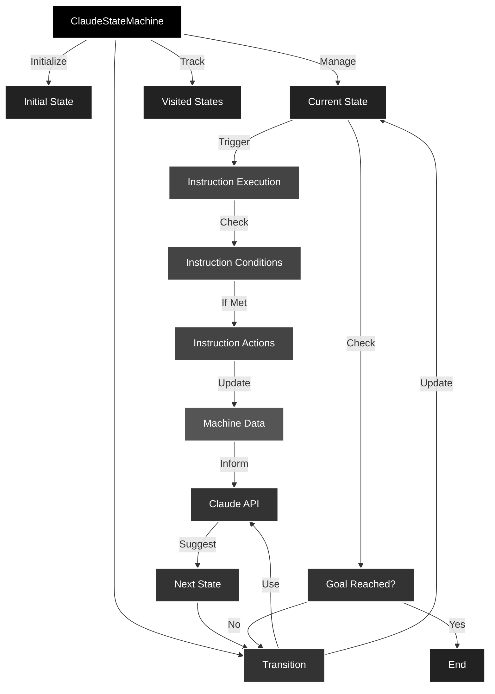

# agent-mst

Agent state machines for primates

### Quickstart
```shell
npm install agent-mst
```



> ### Clarke's third law
> **Any sufficiently advanced technology is indistinguishable from magic.**

## What it does

agent-mst creates state machines for various scenarios (customer support, software development, etc.) and uses Claude, an AI model, to decide state transitions. But why...? **yes**.

## How it works

1. **State Machine Creation**: The project defines different types of state machines (e.g., customer support, software development) in `src/index.ts`. Each state machine has:
   - An initial state
   - Possible states
   - A goal predicate
   - A context prompt
   - Instructions for specific actions

2. **AI-Driven Transitions**: The `getNextState` function in `src/state-handlers.ts` uses the Claude API to determine the next state based on the current context, visited states, and possible transitions.

3. **Execution Flow**:
   - The main loop in `runStateMachine` (src/index.ts) continuously:
     a. Asks Claude for the next state
     b. Transitions to that state
     c. Executes any relevant instructions
     d. Checks if the goal has been reached

4. **Instruction Execution**:
   - After each state transition, the system checks for applicable instructions
   - If an instruction's condition is met, its action is executed
   - Actions can update the machine's data, influencing future state transitions

5. **Flexibility**: The `ClaudeStateMachine` class (src/claude-state-machine.ts) allows for dynamic data storage and custom instructions, making it adaptable to various scenarios.

## Quick Start

This is a standard Bun project. Clone, install dependencies, set up your `.env.local` with a Claude API key, and run:

```
bun run src/index.ts
```

## Extending

Add your own state machine types in `createStateMachine()` (src/index.ts). Follow the existing pattern or something better.

Example:

```typescript
case "newScenario":
return new ClaudeStateMachine({
   initialState: "Start",
   possibleStates: ["Start", "Middle", "End"],
   goalPredicate: (visitedStates) => visitedStates.has("End"),
   contextPrompt: "Description of the new scenario...",
   instructions: [
      {
         condition: (machine) => machine.state === "Middle",
         action: (machine) => {
            machine.setData("middleReached", true);
         },
         description: "Mark when the middle state is reached"
      }
   ]
});
```

## Project Structure

- `src/index.ts`: Main entry point and state machine definitions
- `src/claude-state-machine.ts`: Core `ClaudeStateMachine` class
- `src/claude.ts`: Claude API client setup
- `src/state-handlers.ts`: State transition logic
- `src/types.d.ts`: TypeScript definitions

## Contributing

If you must. Send a PR. Make it good.

## License

MIT © 2024 Geoff Seemueller