# agent-mst

agent state machines for primates 

```mermaid
graph TD
   CSM[ClaudeStateMachine] -->|Initialize| IS[Initial State]
   CSM -->|Manage| CS[Current State]
   CSM -->|Track| VS[Visited States]
   CSM --> TR[Transition]
   TR -->|Use| API[Claude API]
   API -->|Suggest| NS[Next State]
   NS --> TR
   TR -->|Update| CS
   CS -->|Check| GR[Goal Reached?]
   GR -->|No| TR
   GR -->|Yes| END[End]

   style CSM fill:#000000,stroke:#FFFFFF,stroke-width:4px
   style IS fill:#222222,stroke:#FFFFFF,stroke-width:2px
   style CS fill:#222222,stroke:#FFFFFF,stroke-width:2px
   style VS fill:#222222,stroke:#FFFFFF,stroke-width:2px
   style TR fill:#333333,stroke:#FFFFFF,stroke-width:2px
   style API fill:#333333,stroke:#FFFFFF,stroke-width:2px
   style NS fill:#333333,stroke:#FFFFFF,stroke-width:2px
   style GR fill:#333333,stroke:#FFFFFF,stroke-width:2px
   style END fill:#222222,stroke:#FFFFFF,stroke-width:2px
```




> ### Clarke's three laws
> 1. When a distinguished but elderly scientist states that something is possible, he is almost certainly right. When he states that something is impossible, he is very probably wrong.
> 2. The only way of discovering the limits of the possible is to venture a little way past them into the impossible.
> 3. **Any sufficiently advanced technology is indistinguishable from magic.**

## Setup

1. Get Bun: https://bun.sh/
2. Clone this mess:
   ```
   git clone https://github.com/geoffsee/agent-mst.git
   cd agent-mst
   ```
3. Install dependencies:
   ```
   bun install
   ```
4. Set up your env: (automatically picks this up when using `bun run index.ts`)
   ```
   echo "CLAUDE_API_KEY=your_key_here" > .env.local
   ```

## Running

```
bun run src/index.ts
```

It'll spit out some logs. If it doesn't work, check your api key. If it still doesn't work, you probably need more coffee.       
```stdio
➜  agent-mst bun run index.ts

Running customerSupport state machine:
Starting state machine...
Initial state: Initial Contact
Claude's choice: Troubleshooting
Transitioned to state Troubleshooting
Claude's choice: Escalation
Transitioned to state Escalation
Claude's choice: Resolution
Transitioned to state Resolution
Goal reached. Exiting state machine...
Final state: Resolution
Visited states: Initial Contact, Troubleshooting, Escalation, Resolution

Running softwareDevelopment state machine:
Starting state machine...
Initial state: Requirements Gathering
Claude's choice: Design
Transitioned to state Design
Claude's choice: Implementation
Transitioned to state Implementation
Claude's choice: Testing
Transitioned to state Testing
Claude's choice: Deployment
Transitioned to state Deployment
Goal reached. Exiting state machine...
Final state: Deployment
Visited states: Requirements Gathering, Design, Implementation, Testing, Deployment

Running ecommercePurchase state machine:
Starting state machine...
Initial state: Browsing
Claude's choice: Add to Cart
Transitioned to state Add to Cart
Claude's choice: Checkout
Transitioned to state Checkout
Claude's choice: Payment
Transitioned to state Payment
Claude's choice: Order Confirmation
Transitioned to state Order Confirmation
Goal reached. Exiting state machine...
Final state: Order Confirmation
Visited states: Browsing, Add to Cart, Checkout, Payment, Order Confirmation

Running medicalDiagnosis state machine:
Starting state machine...
Initial state: Patient Intake
Claude's choice: Examination
Transitioned to state Examination
Claude's choice: Lab Tests
Transitioned to state Lab Tests
Claude's choice: Diagnosis
Transitioned to state Diagnosis
Claude's choice: Treatment Plan
Transitioned to state Treatment Plan
Goal reached. Exiting state machine...
Final state: Treatment Plan
Visited states: Patient Intake, Examination, Lab Tests, Diagnosis, Treatment Plan
```
## What it does

Creates state machines for various scenarios (customer support, software dev, etc.). Uses Claude to decide state transitions. _But why_...? **yes**.

## Extending

Add your own state machine types in `createStateMachine()`. Follow the existing pattern or something better.

## Structure

- `src/index.ts`: this is what you came for

## Contributing

If you must. Send a PR. Make it good.

## License

MIT. 2024 Geoff Seemueller